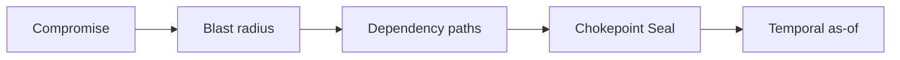
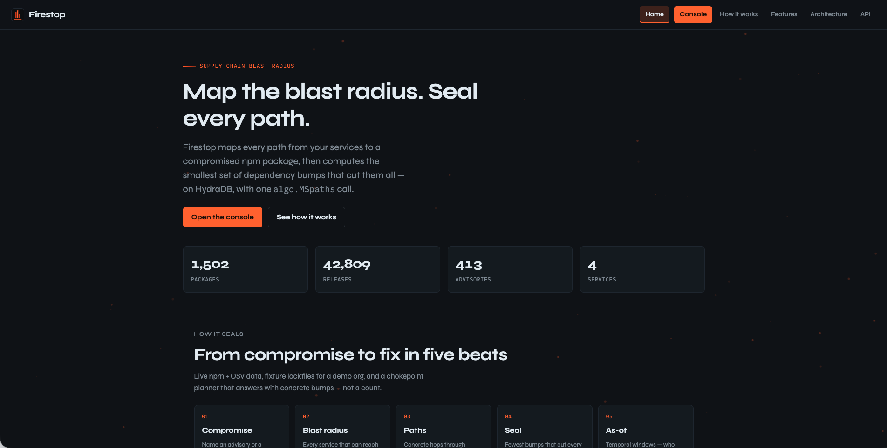
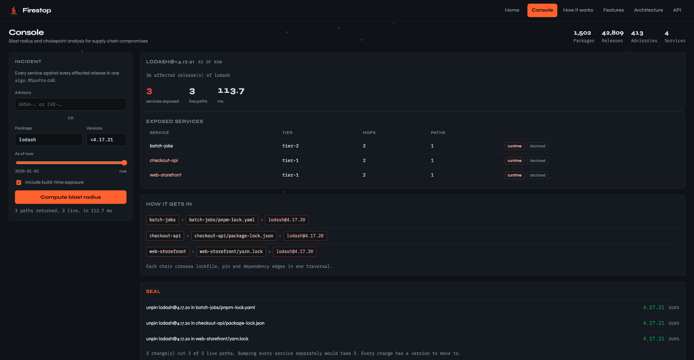
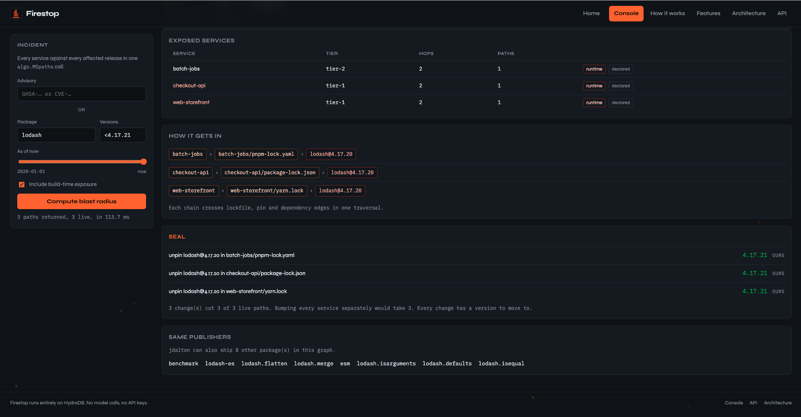
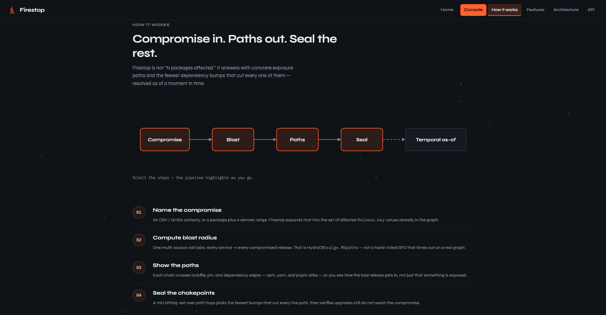

# Firestop

**Seal a compromised npm package before its blast radius reaches your services.**

09:00 — a package you depend on is compromised. 09:06 — which of your services are already exposed, through which path, and what is the smallest change that stops it? Firestop answers all three on HydraDB, in one traversal.

[](https://www.python.org/)
[](LICENSE)
[](tests/)

Built for [Hack Hydra](https://hackhydra.hydradb.com) · Track **2A** (Repos, Dependencies + Code as Graphs)

---

## The problem

A maintainer account gets popped. A popular version ships a backdoor. Within minutes you need three answers:

1. **Which of my services** actually pull that package?
2. **Through which dependency paths?**
3. **What is the smallest set of bumps** that cuts every path?

Most tools stop at “does this lockfile contain a bad version?” — present or absent, nothing more. Firestop answers the question defenders actually have: **reverse-dependency closure** over a versioned, time-aware graph — which services reach the bad release, through which lockfile chains — and then the one that matters in an incident: **the smallest set of bumps that cuts every path.**

---

## What it does

| Capability | What you get |
|---|---|
| **Blast radius** | Every service exposed to a compromise, with the concrete chain (service → lockfile → pins → transitive releases) |
| **Chokepoint Seal** | Minimum set of direct dependency bumps that sever all paths; each proposed upgrade is checked on the graph so a “fix” that still reaches the bad release is refused |
| **Temporal as-of** | `DEPENDS_ON` edges carry validity windows — resolve the graph as it stood at a specific moment (`^1.2.0` meant different things at different install times) |
| **Maintainer pivot** | Expand a compromised publisher to every package they can push |
| **Typosquat radar** | Name-similarity candidates filtered by shared-maintainer structure (cuts the noise) |
| **Eval harness** | Graph-native paths vs hand-rolled BFS + name-similarity baselines |

---

## How it works



1. Name what broke — an OSV advisory, or a package + version range.
2. Firestop asks HydraDB for reverse paths from every monitored service to every malicious release.
3. Paths come back as readable crumbs, not just counts.
4. Chokepoint analysis picks the fewest direct bumps that cut every path, then re-queries the graph to verify.
5. Optional `as_of` timestamp answers “who was exposed *while the bad version was live?*”

---

## Why HydraDB

Track 2A is a graph problem. Firestop stores its entire ecosystem in HydraDB and pushes the traversal into `algo.MSpaths` — not an N×M client-side fan-out. Remove HydraDB and there is no product.

- **`algo.MSpaths`** — many sources against many targets in one call. The blast query asks for paths from every service to every malicious release at once, not an N×M client-side fan-out.
- **Temporal edges** — `DEPENDS_ON` / `DEV_DEPENDS_ON` carry `valid_from` / `valid_to`. Interval filtering happens after the native path procedure returns.
- **Snapshot-pinned reads** — incident queries use strong consistency so a closure cannot straddle concurrent ingest.
- **GraphBLAS CSC traversal** via `graph-indexer` keeps multi-hop reverse closure interactive.
- **Object-store durability** — the graph lives in S3-compatible storage (MinIO locally). Query nodes stay disposable.

---

## Quickstart

Requires Docker Desktop. No cloud account. No API keys beyond the local compose token in `.env.example`.

```bash
cp .env.example .env
docker compose up -d

python -m venv .venv
# Windows:  .venv\Scripts\activate
# macOS/Linux: source .venv/bin/activate
pip install -r requirements.txt
python -m firestop doctor
```

`doctor` round-trips a write. A listening port alone is not proof the node works.

> MinIO is deliberate: the indexer advances its scope cursor with a conditional put. HydraDB’s local-filesystem object-store backend does not implement that, so without MinIO the node serves queries but never publishes a traversal index. Firestop’s queries are multi-hop — compiled CSC generations are not optional.

### Populate the demo graph

```bash
python -m firestop crawl --packages 1500 --depth 3 --windows 3 --data-dir data

# Map OSV npm advisories onto crawled releases
python -m firestop advisories --data-dir data

# Attach the bundled four-service org (npm + yarn + pnpm lockfiles)
python -m firestop lockfiles --org fixtures/acme
```

The crawl runs alongside the containers, so give Docker enough memory (the compose file already caps each container). If a crawl is killed, give Docker more memory and re-run — it resumes from its checkpoint.

### Open the UI

```bash
python -m firestop serve
# http://127.0.0.1:8000           landing
# http://127.0.0.1:8000/console  live blast / Seal console
# http://127.0.0.1:8000/docs     OpenAPI
```

---

## Live demo — lodash

After the graph is populated:

```bash
# Who is exposed, and through what path?
python -m firestop blast --package lodash --versions "<4.17.21"

# Fewest changes that cut every path
python -m firestop fix --package lodash --versions "<4.17.21"
```

Expected shape on the demo org:

- **3 services exposed** — checkout-api, web-storefront, batch-jobs
- Concrete paths through **npm** (`package-lock.json`), **yarn** (`yarn.lock`), and **pnpm** (`pnpm-lock.yaml`) — same bad pin, three managers, one graph
- **Seal** bumps lodash to **`4.17.21`** in each lockfile; every proposed change is checked on the graph so a “fix” that still reaches the bad release is refused

Same flow in the browser: open `/console`, leave the lodash defaults, hit **Blast**, then **Seal**.

Other commands:

```bash
python -m firestop blast --advisory GHSA-xxxx-xxxx-xxxx
python -m firestop pivot lodash
python -m firestop typosquat
python -m firestop evaluate --incidents 10
python -m firestop doctor --edges   # also counts relationships (slow on a full graph)
```

---

## Screenshots









---

## API

Read-only. Ingest stays in the CLI.

| Method | Path | Purpose |
|---|---|---|
| `GET` | `/api/health` | Node readiness + vertex census |
| `GET` | `/api/overview` | Services, top packages, recent advisories |
| `GET` | `/api/blast` | Blast radius (`advisory` *or* `package` + `versions`) |
| `GET` | `/api/fix` | Chokepoint Seal plan |
| `GET` | `/api/reach` | Reachability for one service |
| `GET` | `/api/pivot` | Maintainer pivot |
| `GET` | `/api/typosquat` | Typosquat candidates |

Interactive docs: [`/docs`](http://127.0.0.1:8000/docs) after `serve`.

---

## Project layout

```
firestop/
  hydra/        HydraDB HTTP client, Bolt helpers, value coercion
  schema/       Labels, relationships, indexes, bootstrap / doctor
  npm/          Packument crawl → temporal DEPENDS_ON edges
  osv/          Advisory ingest + semver matching
  lockfile/     npm / yarn / pnpm parsers + org attachment
  query/        Blast, paths, temporal, chokepoint, pivot, typosquat
  eval/         Baselines + harness
  api/          FastAPI (read-only)
  web/          Multi-page UI (landing, console, explainers)
  cli.py        Typer entrypoint
fixtures/acme/  Four-service demo org with real lockfile formats
tests/          Pytest suite (no live HydraDB required)
docker-compose.yml
```

---

## Testing

```bash
pip install -r requirements-dev.txt
pytest
ruff check firestop tests
```

~330 tests. Query and ingest modules are covered with fakes — you do not need Docker running for CI-style runs.

---

## Stack

- **Python 3.11+** · FastAPI · httpx · Typer · Pydantic
- **HydraDB** (graph-node + graph-indexer) · MinIO
- Static HTML/CSS/JS UI — no build step, no CDN

HydraDB is run as a separate service over its network protocol. No HydraDB source is vendored here ([AGPL-3.0](https://github.com/hydra-db/hydradb)).

Vulnerability ground truth: [OSV](https://osv.dev) npm bulk export. Package metadata: [npm registry](https://registry.npmjs.org).

---

## License

MIT. See [LICENSE](LICENSE).
